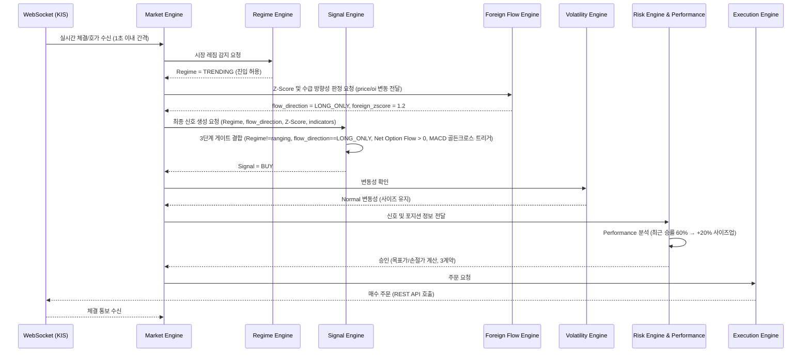
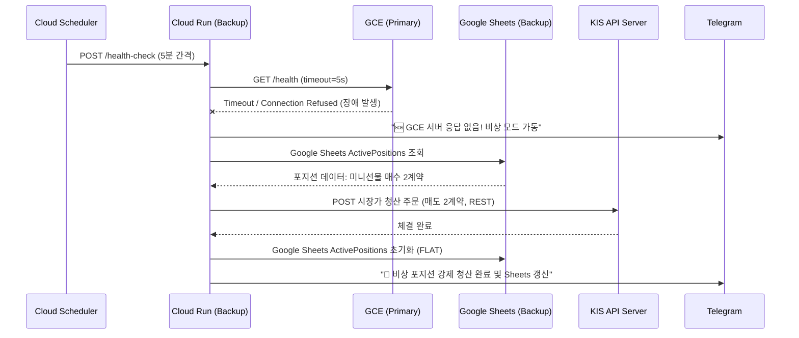
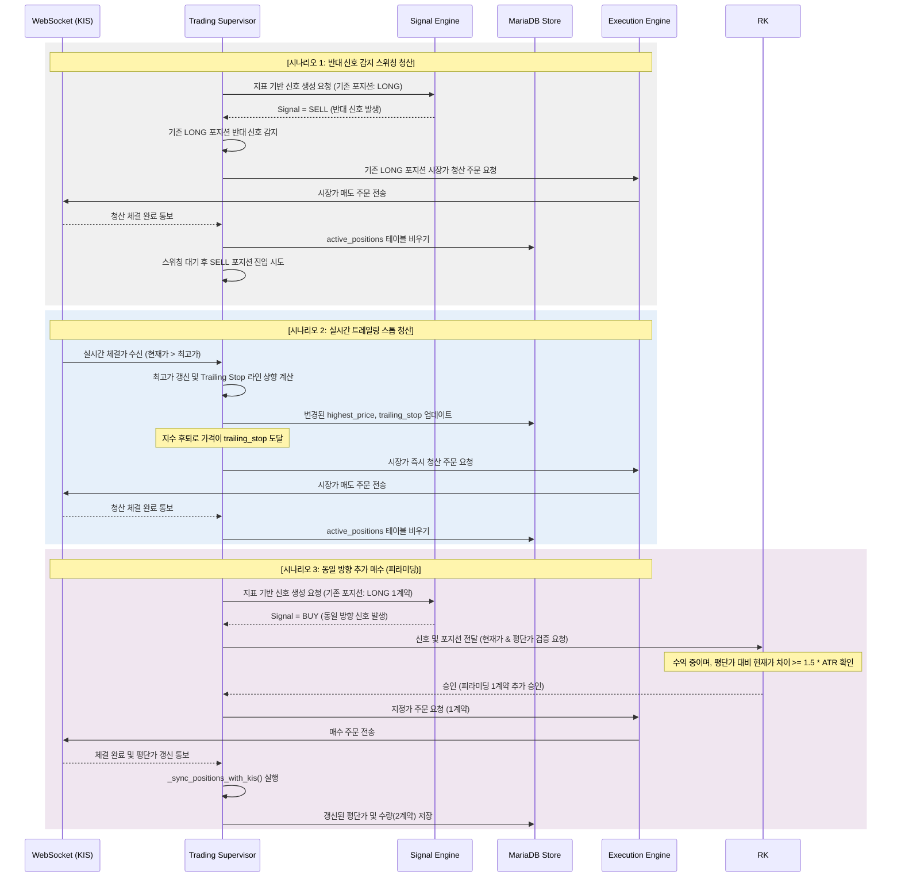

# Agent Guide — KOSPI200선물, 개별주식선물, 금선물 등 AI 자동매매 시스템

> **Version**: 3.1  
> **Last Updated**: 2026-06-14  
> **Purpose**: AI 에이전트(Gemini, Claude 등)와 MCP 도구가 GCE + Cloud Run 하이브리드 아키텍처에서 어떤 역할을 하는지 정의

---

## 1. Agent Philosophy

> **AI는 "트레이더"가 아니라 "감시자"이다.**

```
┌─────────────────────────────────────────────────────────────────────────────┐
│                              매매 결정 권한 구조                              │
│                                                                             │
│   ┌──────────────┐     ┌──────────────┐    ┌──────────────┐    ┌─────────┐  │
│   │Regime Engine │──▶  │Signal Engine │──▶ │Risk Engine   │──▶ │Execution│  │
│   │(시장상태판별)│     │(규칙기반)     │    │(최종검증)     │    │Engine   │  │
│   └──────┬───────┘     └──────────────┘    └──────┬───────┘    └─────────┘  │
│          │                                        │                         │
│          ▼ 참고                                   │ Veto (차단권한)          │
│   ┌──────────────┐                        ┌───────▼───────┐                 │
│   │ AI Risk      │───────────────────────▶│ Risk Score    │                 │
│   │ Agent        │  보조정보 제공           │ ≥ 0.8 차단    │                 │
│   └──────────────┘                        └───────────────┘                 │
│                                                                             │
│   ✅ 규칙 기반 엔진 = 매매 결정권 (추세, 수급, 변동성, 성과 모두 수치 기반)         │
│   ⚠️ AI 에이전트 = 거시경제/뉴스 분석, 보조/감시 역할만                         │
│   ❌ AI 단독 매매 = 절대 금지                                               │
└─────────────────────────────────────────────────────────────────────────────┘
```

---

## 2. AI Agents 정의 (GCE 환경 기반)

### 2.1 AI Risk Agent (핵심 에이전트)

**Role**: 시장 위험도를 분석하고 Risk Engine에 보조 정보를 제공  
**Deployment**: GCE 메인 프로세스 내부에서 비동기 워커로 실행

**호출 시점**:
- 정규: 매 시간 정각 (1시간 간격)
- 긴급: 가격 급등락(VIX 등) 감지 시 Volatility Engine의 요청으로 즉시 실행

**Prompt Template (Regime Engine 연계 강화)**:
```python
RISK_ANALYSIS_PROMPT = """
당신은 KOSPI200 선물 시장의 거시 경제 및 뉴스 분석가입니다.

[현재 시장 데이터 (Regime Engine 제공)]
- 시스템 판별 레짐: {current_regime}
- KOSPI200 선물 현재가: {current_price}
- VIX: {vix}
- 외국인 누적 순매수: {foreign_net}
- 환율: {usd_krw}

[최근 뉴스 헤드라인]
{news_headlines}

위 정보를 바탕으로 아래 JSON을 응답하세요.
(시스템이 판별한 레짐과 뉴스의 거시적 상황이 일치하는지 확인 필수)
{
    "risk_score": 0.0~1.0 사이 숫자,
    "macro_regime_match": true/false (시스템 레짐과 뉴스 상황의 일치 여부),
    "key_risks": ["위험 요인 1", "위험 요인 2"],
    "recommendation": "normal" | "reduce" | "halt",
    "reasoning": "판단 근거 1~2문장"
}
"""
```

### 2.2 News Analyzer Agent

**Role**: 글로벌 매크로(Finnhub)와 국내 뉴스(네이버/KRX)를 수집하여 AI Risk Agent에 요약 전달

---

## 3. MCP Integration in Dual Runtime

### 3.1 아키텍처 개요 (GCE 주력)

```
┌───────────────────────── GCE (Ubuntu 24.04) ───────────────────────────┐
│                                                                        │
│   ┌─────────────┐       ┌──────────────────────────┐                   │
│   │ Trading App │◄─────▶│ KIS Trading MCP Server   │                   │
│   │ (Python)    │       │ (Docker Sidecar, :3000) │                   │
│   └──────┬──────┘       └──────────────────────────┘                   │
│          │                                                             │
│          │ (1) WebSocket 상시 연결 [실시간-010,011,012]                │
│          │ (2) REST 직접 호출 (MCP 폴백)                                │
│          ▼                                                             │
│   ┌──────────────────────────────────────────────────────┐            │
│   │            KIS Open API Server                        │            │
│   └──────────────────────────────────────────────────────┘            │
└────────────────────────────────────────────────────────────────────────┘
```

**MCP 활용 전략 변경**:
- **GCE 환경**에서는 MCP 서버를 Docker 컨테이너로 항상 띄워둘 수 있어 안정성이 높다.
- 단, **실시간 체결가/호가/손절**은 MCP 구조를 거치면 약간의 지연이 생길 수 있으므로 **Python WebSocket 모듈에서 직접 KIS 서버로 연결**한다.
- 계좌 조회, 주문(일반 지정가), 과거 차트 조회 등은 **MCP**를 적극 활용한다.
- 긴급 손절 시장가 주문은 REST API를 직접 호출하여 응답 속도를 극대화한다.

### 3.2 Cloud Run (Backup) 에서의 통신

- Cloud Run 백업 인스턴스는 MCP 서버를 띄우기엔 무거울 수 있다.
- Cloud Run은 직접 KIS REST API를 호출(Fallback 모드)하여 긴급 포지션 청산(`emergency_close`)만을 담당한다.

---

## 4. Agent Communication Flow

### 4.1 주간/야간 정상 매매 사이클 (GCE)



### 4.2 GCE 장애 시 Cloud Run 백업 사이클 (Google Sheets 활용)



### 4.3 포지션 청산 및 스위칭 사이클 (Exit & Switching Flow)



---

## 5. Development Workflow with MCP

### 5.1 KIS Code Assistant 활용법 (Cursor/Claude)

GCE 환경으로 변경됨에 따라, 백그라운드 데몬 작성법 등을 Assistant에 추가로 질문해야 함.

| 활용 시나리오 | 예시 질문 |
|-------------|----------|
| WS 재연결 로직 | "KIS WebSocket 체결통보 [실시간-012] 끊김 시 재연결 코드 어떻게 작성해?" |
| GCE 배포 스크립트 | "Ubuntu 24.04에서 systemd로 Python 스크립트를 데몬으로 띄우는 코드 알려줘." |
| 비동기 프로그래밍 | "asyncio 큐를 이용해서 WS 수신부와 매매 로직을 분리하는 방법" |

---

## 6. Gemini API 비용 최적화 (유지)

- GCE 상시 연결로 바뀌었더라도, 거시 경제 판단용 뉴스 분석은 1시간 간격으로 호출.
- GCE 장애가 났을 때 Cloud Run이 백업 용도로 긴급히 Gemini에 텍스트 요약을 요청할 수 있지만 한도 내 충분히 커버 가능.
