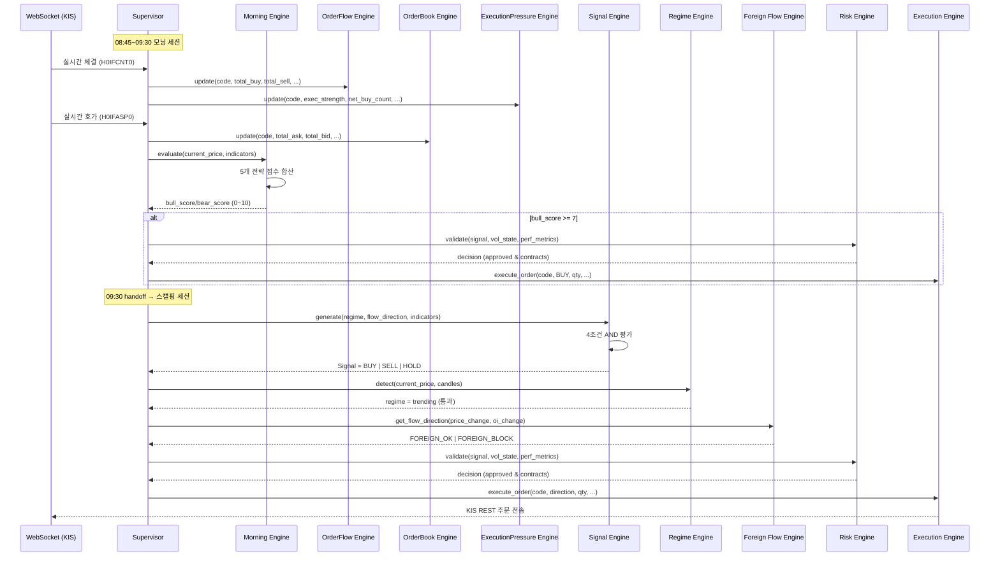

# Agent Guide — KOSPI200선물 AI 자동매매 시스템 (스캘핑)

> **Version**: 5.0
> **Last Updated**: 2026-06-16
> **Purpose**: AI 에이전트(Gemini, Claude 등) 역할 정의

---

## 1. Agent Philosophy

> **AI는 "트레이더"가 아니라 "감시자"이다.**

```
┌───────────────────────────────────────────────────────────────────────────┐
│                         매매 결정 권한 구조 (Dual Session)                  │
│                                                                           │
│  ┌─ 08:45~09:30 ──────────────────────────────────────────────────────┐  │
│  │  Morning Engine (5개 전략 + 점수 시스템)                             │  │
│  │  ├─ Overnight Score (CME/S&P/NASDAQ/환율/OI)                       │  │
│  │  ├─ Gap Analysis (갭 방향 추종)                                      │  │
│  │  ├─ Opening Range Breakout (ORB)                                     │  │
│  │  ├─ Foreign Open Attack (CVD+OI+Basis)                               │  │
│  │  └─ Gap Fill (갭 과대 역방향)                                         │  │
│  │                                                                      │  │
│  │  bull_score/bear_score (0~10) → 7점 이상 진입                        │  │
│  └──────────────────────────────────────────────────────────────────────┘  │
│       │                                                                   │
│       ▼ 09:30 handoff                                                     │
│  ┌─ 09:30~15:45 ──────────────────────────────────────────────────────┐  │
│  │  Scalping Engine (4조건 AND 게이트)                                   │  │
│  │  OrderFlow ─┐                                                        │  │
│  │  OrderBook ─┤→ Signal Engine → Regime → Foreign Flow → Risk → Exec   │  │
│  │  ExecPress ─┘   (4조건 AND)   (검증)    (필터)       (최종)           │  │
│  └──────────────────────────────────────────────────────────────────────┘  │
│                                                                           │
│  AI Risk Agent ──────────────────────────▶ Risk Engine (보조정보 제공)     │
│                                                                           │
│  ✅ 규칙 기반 엔진 = 매매 결정권                                          │
│  ⚠️ AI 에이전트 = 거시경제/뉴스 분석, 보조/감시 역할만                      │
│  ❌ AI 단독 매매 = 절대 금지                                               │
└───────────────────────────────────────────────────────────────────────────┘
```

---

## 2. AI Agents

### 2.1 AI Risk Agent

**Role**: 규칙 기반 엔진에 보조 정보 제공 (뉴스 분석, 거시경제 확인)
**호출**: 매시간 정각
**의결권**: 없음 (Risk Engine에 veto 권한만 있음)

### 2.2 Telegram Agent

**Role**: Morning Briefing 생성 (Gemini), 사용자 명령 수신, 알림 발송
**모닝 엔전 연동**: 야간 컨텍스트 데이터 수집 → MorningEngine.set_overnight_context() 주입

---

## 3. Agent Communication Flow (Dual Session)



---

## 4. Morning Engine Strategies

### 4.1 Overnight Score (최대 4점)

야간 시장 데이터 기반 사전 점수 (장 시작 전 이미 계산됨):

| 조건 | Bull | Bear |
|------|------|------|
| 야간 미니선물 > +0.3% | +1 | - |
| 야간 미니선물 < -0.3% | - | +1 |
| S&P500 > +0.5% | +1 | - |
| S&P500 < -0.5% | - | +1 |
| NASDAQ > +0.8% | +1 | - |
| NASDAQ < -0.8% | - | +1 |
| USD/KRW < -0.2% (원화강세) | +1 | - |
| USD/KRW > +0.2% (원화약세) | - | +1 |

### 4.2 Gap Analysis (최대 3점)

시초 갭 방향 추종:

| 갭 | 점수 |
|----|------|
| Gap > +1.0% | Bull +3 |
| Gap > +0.5% | Bull +2 |
| Gap > +0.2% | Bull +1 |
| Gap < -1.0% | Bear +3 |
| Gap < -0.5% | Bear +2 |
| Gap < -0.2% | Bear +1 |

### 4.3 Opening Range Breakout (최대 3점)

08:45~08:50 5분 범위 돌파 매매:

| 조건 | 점수 |
|------|------|
| ORB 고점 돌파 + 체결강도 >= 110 | Bull +3 |
| ORB 고점 돌파 + 체결강도 >= 100 | Bull +2 |
| ORB 저점 이탈 + 체결강도 <= 90 | Bear +3 |
| ORB 저점 이탈 + 체결강도 <= 100 | Bear +2 |

### 4.4 Foreign Open Attack (최대 3점)

외국인 첫 진입 분석:

| 조건 | 점수 |
|------|------|
| CVD > 50 + OI > 5 + Basis > 0.5 | Bull +3 |
| CVD > 50 + OI > 5 | Bull +2 |
| CVD < -50 + OI > 5 + Basis < -0.5 | Bear +3 |
| CVD < -50 + OI > 5 | Bear +2 |

### 4.5 Gap Fill (최대 2점)

갭 과대 시 역방향:

| 조건 | 점수 |
|------|------|
| Gap > +2.0% | Bear +2 |
| Gap > +1.5% | Bear +1 |
| Gap < -2.0% | Bull +2 |
| Gap < -1.5% | Bull +1 |
