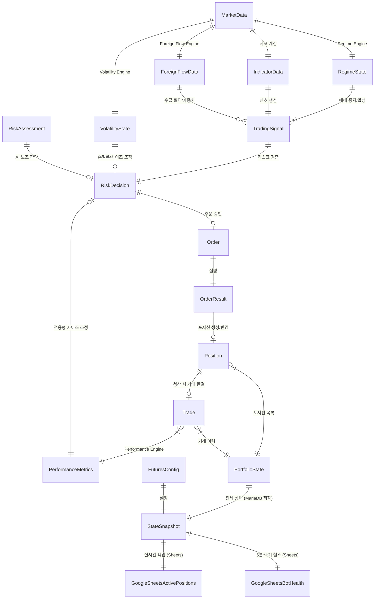

# Schema — KOSPI200 미니선물 AI 자동매매 시스템 데이터 모델

> **Version**: 3.0  
> **Last Updated**: 2026-06-10  
> **Target**: GCE (상시 실행, WebSocket 기반) + Cloud Run (비상 백업)

---

## 1. Overview

이 문서는 `future/models/schemas.py`에 구현될 모든 데이터 모델을 정의한다.  
Python `dataclass` + `Pydantic` 기반으로, 타입 안전성과 런타임 검증을 보장한다.

새롭게 추가된 4개의 핵심 엔진(`RegimeEngine`, `ForeignFlowEngine`, `VolatilityEngine`, `PerformanceEngine`)의 입출력 모델이 포함되었다.

```python
# future/models/schemas.py
from __future__ import annotations
from dataclasses import dataclass, field
from datetime import datetime
from enum import Enum
from typing import Optional
```

---

## 2. Enums (열거형)

### 2.1 Market Regime (강화)

```python
class MarketRegime(str, Enum):
    """시장 상태 (Regime Engine 판별)"""
    TRENDING = "trending"       # 강한 추세 (ADX > 25)
    WEAK_TREND = "weak_trend"   # 약한 추세 (20 <= ADX <= 25)
    RANGING = "ranging"         # 횡보장 (ADX < 20 & BBW 수축) → 매매 중지
    VOLATILE = "volatile"       # 고변동성장 (ATR > 2*MA) → 사이즈 축소
```

### 2.2 Volatility Level (신규)

```python
class VolatilityLevel(str, Enum):
    """변동성 수준"""
    LOW = "low"                 # ATR Ratio < 0.7
    NORMAL = "normal"           # 0.7 <= ATR Ratio < 1.5
    HIGH = "high"               # 1.5 <= ATR Ratio < 2.0
    EXTREME = "extreme"         # ATR Ratio >= 2.0
```

### 2.3 기타 열거형 (기존과 동일)

- `MarketSession`: PRE_MARKET(08:00~08:45), DAY_MARKET(08:45~15:45 / 최종거래일 15:20), DAY_CLOSE, GAP, NIGHT_MARKET(18:00~익일 06:00), NIGHT_CLOSE, SLEEP
- `SignalDirection`: BUY, SELL, HOLD
- `OrderSide`: BUY("02"), SELL("01")
- `OrderType`: LIMIT("01"), MARKET("02"), CONDITIONAL("03"), BEST("04")
- `OrderCondition`: NONE("0"), IOC("3"), FOK("4")
- `PositionSide`: LONG, SHORT, FLAT
- `TradingMode`: BACKTEST, PAPER, LIVE

---

## 3. Engine States (신규 추가된 엔진들의 출력)

### 3.1 RegimeState — 시장 상태 판별 결과

```python
@dataclass
class RegimeState:
    """Regime Engine의 분석 결과"""
    timestamp: datetime
    regime: MarketRegime
    adx: float
    atr: float
    volatility_level: VolatilityLevel
    trend_strength: str             # "strong", "weak", "none"
    action: str                     # "추세추종 활성화", "매매 중지" 등
    signal_allowed: bool            # 신규 진입 허용 여부 (RANGING이면 False)
    size_multiplier: float          # 레짐에 따른 권장 사이즈 배수 (0.0 ~ 1.0)
```

### 3.2 ForeignFlowData — 외국인 수급 분석 결과

```python
@dataclass
class ForeignFlowData:
    """Foreign Flow Engine의 분석 결과"""
    timestamp: datetime
    foreign_net_buy: int            # 외국인 순매수(계약)
    institution_net_buy: int        # 기관 순매수(계약)
    individual_net_buy: int         # 개인 순매수(계약)
    foreign_oi_change: int          # 외국인 미결제약정 변화
    foreign_net_buy_1m: int         # 최근 1분간 외국인 순매수 변동량
    is_foreign_buying: bool         # 순매수 > 0 여부
    flow_strength: float            # 수급 강도 (0.0 ~ 1.0)
```

### 3.3 VolatilityState — 변동성 분석 결과

```python
@dataclass
class VolatilityState:
    """Volatility Engine의 분석 결과"""
    timestamp: datetime
    level: VolatilityLevel
    atr: float
    atr_ratio: float                # ATR / ATR_MA20
    size_multiplier: float          # 변동성에 따른 권장 사이즈 배수 (0.3 ~ 1.0)
    stop_loss_multiplier: float     # 손절 폭 배수 (변동성 클수록 넓게)
    take_profit_multiplier: float   # 익절 폭 배수
```

### 3.4 PerformanceMetrics — 성과 기반 사이징 입력

```python
@dataclass
class PerformanceMetrics:
    """Performance Engine의 분석 결과"""
    timestamp: datetime
    recent_win_rate: float          # 최근 20거래 승률
    recent_avg_pnl: float           # 최근 평균 손익
    recent_mdd: float               # 최근 구간 MDD
    consecutive_losses: int         # 연속 손실 횟수
    size_multiplier: float          # 성과에 따른 권장 사이즈 배수 (0.25 ~ 1.5)
```

---

## 4. Market Data & Indicators

### 4.1 MarketData (수정)

WebSocket을 통해 들어오는 실시간 데이터 처리를 위해 속성 추가.

```python
@dataclass
class MarketData:
    timestamp: datetime
    session: MarketSession
    futures_code: str
    
    current_price: float
    open_price: float
    high_price: float
    low_price: float
    prev_close: float
    volume: int
    open_interest: int
    
    best_bid: float
    best_ask: float
    spread: float
    
    # WebSocket 수신 여부 플래그
    is_realtime: bool = False
```

### 4.2 IndicatorData (기존과 동일)
- `ma5, ma20, ma60, adx, atr, macd, bollinger_band` 등

---

## 5. Signal & Risk Models

### 5.1 TradingSignal (수정)

```python
@dataclass
class TradingSignal:
    timestamp: datetime
    futures_code: str
    direction: SignalDirection
    strength: float                 # 신호 강도 (BUY/SELL 이면 1.0, HOLD 이면 0.0)
    score: int                      # 신호 점수 (BUY: 100, SELL: -100, HOLD: 0)
    reasons: list[str]              # 신호 발생 및 차단 사유 기록
    regime: MarketRegime            # 판정된 시장 레짐
    flow_direction: str             # 판정된 수급 방향성 (LONG_ONLY, SHORT_ONLY, NEUTRAL 등)
    foreign_zscore: float           # 외국인 수급 Z-Score
```

### 5.2 RiskAssessment & RiskDecision (기존과 동일)
- `RiskAssessment`: AI Risk Agent 분석
- `RiskDecision`: Risk Engine 승인/거절

---

## 6. Order, Position, Portfolio Models

### 6.1 Order, OrderResult (기존과 동일)

### 6.2 Position (수정 - WebSocket 실시간 손절 대응)

```python
@dataclass
class Position:
    position_id: str
    futures_code: str
    market: str
    side: PositionSide
    quantity: int
    avg_price: float
    
    stop_loss: float
    take_profit: float
    trailing_stop: Optional[float] = None
    
    # ── 실시간 감시용 필드 ──
    highest_price: Optional[float] = None
    lowest_price: Optional[float] = None
    last_checked_price: Optional[float] = None
    
    # ── 손익 ──
    def unrealized_pnl(self, current_price: float, point_value: float = 50000) -> float: ...
    def should_stop_loss(self, current_price: float) -> bool: ...
    def update_trailing_stop(self, current_price: float, atr: float, multiplier: float = 2.0): ...
```

### 6.3 PortfolioState (기존과 동일)

---

## 7. Configuration Models

### 7.1 FuturesConfig (수정 - 하이브리드 인프라 설정)

```python
@dataclass
class FuturesConfig:
    """선물 자동매매 전용 설정 (GCE + Cloud Run)"""
    
    # ── 계좌 ──
    total_capital: int = 100_000_000
    account_product_code: str = "03"
    is_paper: bool = True
    
    # ── 인프라 ──
    runtime_env: str = "gce"                # "gce" | "cloud_run"
    ws_reconnect_interval_sec: int = 5      # WS 재연결 대기시간
    
    # ── 리스크 관리 ──
    single_trade_risk: float = 0.01         # 1회 최대 손실 (1%)
    daily_loss_limit: float = 0.02          # 일 최대 손실 (2%)
    weekly_loss_limit: float = 0.05         # 주 최대 손실 (5%)
    max_drawdown_limit: float = 0.10        # 최대 낙폭 한도 (10%)
    max_contracts: int = 5                  # 최대 계약 수
    
    # ── 전략/엔진 파라미터 ──
    foreign_flow_threshold: int = 500       # 수급 필터 임계값 (계약 수)
    min_win_rate_threshold: float = 0.30    # 성과 사이징 최소 승률 임계값
    
    # ── 스케줄 ──
    # 폴링 간격은 이제 REST 보조 데이터 조회 용도임 (기본 1분)
    rest_sync_interval_min: int = 1
```

---

## 8. Schema Relationships (업데이트)



---

## 9. MariaDB DDL Schema Definition (신규)

시스템의 GCE 로컬 데이터 유지를 위한 MariaDB 테이블 스키마 DDL 정의이다.

```sql
-- 데이터베이스 생성
CREATE DATABASE IF NOT EXISTS kis_trading DEFAULT CHARACTER SET utf8mb4 COLLATE utf8mb4_unicode_ci;
USE kis_trading;

-- 1. Active Positions (실시간 보유 포지션)
CREATE TABLE IF NOT EXISTS active_positions (
    position_id VARCHAR(50) PRIMARY KEY,
    futures_code VARCHAR(20) NOT NULL,
    market VARCHAR(20) NOT NULL,
    side VARCHAR(10) NOT NULL,            -- 'LONG', 'SHORT'
    quantity INT NOT NULL,
    avg_price DECIMAL(10, 2) NOT NULL,
    stop_loss DECIMAL(10, 2) NOT NULL,
    take_profit DECIMAL(10, 2) NOT NULL,
    trailing_stop DECIMAL(10, 2) DEFAULT NULL,
    highest_price DECIMAL(10, 2) DEFAULT NULL,
    lowest_price DECIMAL(10, 2) DEFAULT NULL,
    last_checked_price DECIMAL(10, 2) DEFAULT NULL,
    updated_at TIMESTAMP DEFAULT CURRENT_TIMESTAMP ON UPDATE CURRENT_TIMESTAMP,
    INDEX idx_positions_code (futures_code)
) ENGINE=InnoDB;

-- 2. Orders (주문 내역)
CREATE TABLE IF NOT EXISTS orders (
    order_id VARCHAR(50) PRIMARY KEY,
    futures_code VARCHAR(20) NOT NULL,
    order_side VARCHAR(10) NOT NULL,      -- 'BUY', 'SELL'
    order_qty INT NOT NULL,
    order_price DECIMAL(10, 2) NOT NULL,
    order_type VARCHAR(20) NOT NULL,      -- 'LIMIT', 'MARKET', 'CONDITIONAL'
    status VARCHAR(20) NOT NULL,          -- 'PENDING', 'FILLED', 'REJECTED', 'CANCELLED'
    result_msg VARCHAR(255) DEFAULT NULL,
    ordered_at TIMESTAMP DEFAULT CURRENT_TIMESTAMP,
    INDEX idx_orders_code_time (futures_code, ordered_at)
) ENGINE=InnoDB;

-- 3. Trades (청산 완료된 거래 내역)
CREATE TABLE IF NOT EXISTS trades (
    trade_id VARCHAR(50) PRIMARY KEY,
    futures_code VARCHAR(20) NOT NULL,
    entry_side VARCHAR(10) NOT NULL,
    entry_qty INT NOT NULL,
    entry_price DECIMAL(10, 2) NOT NULL,
    exit_price DECIMAL(10, 2) NOT NULL,
    entry_time TIMESTAMP NOT NULL,
    exit_time TIMESTAMP DEFAULT CURRENT_TIMESTAMP,
    net_pnl DECIMAL(15, 2) NOT NULL,
    fee DECIMAL(10, 2) NOT NULL,
    INDEX idx_trades_time (exit_time)
) ENGINE=InnoDB;

-- 4. Regime States (시장 레짐 판별 이력)
CREATE TABLE IF NOT EXISTS regime_states (
    id INT AUTO_INCREMENT PRIMARY KEY,
    detected_at TIMESTAMP DEFAULT CURRENT_TIMESTAMP,
    regime VARCHAR(20) NOT NULL,          -- 'trending', 'weak_trend', 'ranging', 'volatile'
    adx DECIMAL(5, 2) NOT NULL,
    atr DECIMAL(5, 2) NOT NULL,
    volatility_level VARCHAR(15) NOT NULL, -- 'low', 'normal', 'high', 'extreme'
    trend_strength VARCHAR(10) NOT NULL,  -- 'strong', 'weak', 'none'
    action VARCHAR(100) NOT NULL,
    signal_allowed TINYINT(1) NOT NULL,
    size_multiplier DECIMAL(3, 2) NOT NULL,
    INDEX idx_regime_time (detected_at)
) ENGINE=InnoDB;

-- 5. Foreign Flows (외국인 수급 이력)
CREATE TABLE IF NOT EXISTS foreign_flows (
    id INT AUTO_INCREMENT PRIMARY KEY,
    fetched_at TIMESTAMP DEFAULT CURRENT_TIMESTAMP,
    foreign_net_buy INT NOT NULL,
    institution_net_buy INT NOT NULL,
    individual_net_buy INT NOT NULL,
    foreign_oi_change INT NOT NULL,       -- 외국인 미결제약정 변화 (KIS API 제한으로 인해 0으로 기록되나 스키마 호환 유지)
    flow_strength DECIMAL(3, 2) NOT NULL,
    foreign_net_buy_1m INT DEFAULT 0 NOT NULL, -- 최근 1분간 외국인 순매수 변동량
    INDEX idx_flows_time (fetched_at)
) ENGINE=InnoDB;

-- 6. Performance Metrics (최근 성과 지표)
CREATE TABLE IF NOT EXISTS performance_metrics (
    id INT AUTO_INCREMENT PRIMARY KEY,
    calculated_at TIMESTAMP DEFAULT CURRENT_TIMESTAMP,
    recent_win_rate DECIMAL(4, 3) NOT NULL,
    recent_avg_pnl DECIMAL(15, 2) NOT NULL,
    recent_mdd DECIMAL(5, 4) NOT NULL,
    consecutive_losses INT NOT NULL,
    size_multiplier DECIMAL(3, 2) NOT NULL,
    INDEX idx_perf_time (calculated_at)
) ENGINE=InnoDB;

-- 7. Market Candles (1분봉 시세 데이터 - 과거 5년치 및 향후 누적 데이터)
CREATE TABLE IF NOT EXISTS market_candles (
    futures_code VARCHAR(20) NOT NULL,
    candle_time DATETIME NOT NULL,
    open DECIMAL(10, 2) NOT NULL,
    high DECIMAL(10, 2) NOT NULL,
    low DECIMAL(10, 2) NOT NULL,
    close DECIMAL(10, 2) NOT NULL,
    volume INT NOT NULL,
    open_interest INT NOT NULL,           -- 미결제약정 (실시간 틱으로부터 집계, 차트 지표 oi_change 계산의 근거로 활용)
    accum_amount DECIMAL(20, 2) DEFAULT NULL,
    foreign_call_net INT DEFAULT NULL,    -- 외인 콜옵션 당일 누적 순매수 수량
    foreign_put_net INT DEFAULT NULL,     -- 외인 풋옵션 당일 누적 순매수 수량
    PRIMARY KEY (futures_code, candle_time),
    INDEX idx_candles_time (candle_time)
) ENGINE=InnoDB;

-- 8. Morning Briefing Scores (아침 브리핑 점수 및 방향)
CREATE TABLE IF NOT EXISTS morning_briefing_scores (
    briefing_date DATE PRIMARY KEY,
    score DECIMAL(3, 2) NOT NULL,
    direction VARCHAR(10) NOT NULL,
    rationale TEXT,
    kospi200 DECIMAL(10, 2) DEFAULT NULL,
    kospi DECIMAL(10, 2) DEFAULT NULL,
    kosdaq DECIMAL(10, 2) DEFAULT NULL,
    sp500 DECIMAL(10, 2) DEFAULT NULL,
    nasdaq DECIMAL(10, 2) DEFAULT NULL,
    dow DECIMAL(10, 2) DEFAULT NULL,
    nasdaq_futures DECIMAL(10, 2) DEFAULT NULL,
    usd_krw DECIMAL(10, 2) DEFAULT NULL,
    nikkei225 DECIMAL(10, 2) DEFAULT NULL,
    created_at TIMESTAMP DEFAULT CURRENT_TIMESTAMP
) ENGINE=InnoDB;

```

